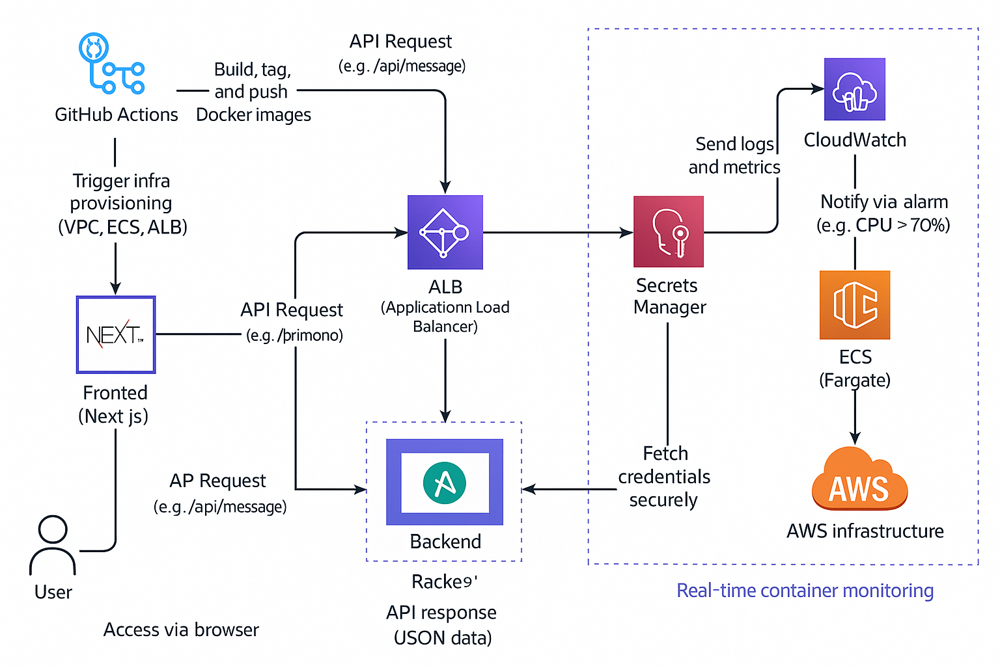

# 🛠️ End-to-End Full-Stack App Deployment on AWS

This project demonstrates DevOps best practices by building, containerizing, testing, deploying, and monitoring a full-stack web application (FastAPI backend + Next.js frontend) on AWS using GitHub Actions, Docker, Terraform, and other DevOps tools.

---

## 📦 Tech Stack

- **Backend**: Python (FastAPI)
- **Frontend**: Next.js (React)
- **CI/CD**: GitHub Actions
- **Containers**: Docker
- **Infrastructure as Code**: Terraform (AWS ECS + Fargate, ALB)
- **Monitoring**: AWS CloudWatch
- **Secrets & Security**: AWS Secrets Manager, IAM
- **Load Balancing**: AWS Application Load Balancer

---

## 🗂️ Repository Structure

```
/backend/       # Python FastAPI REST API
/frontend/      # Next.js web frontend
/.github/       # GitHub Actions workflows
/terraform/     # IaC configs for ECS, VPC, ALB, IAM, etc.
/assets/        # Architecture diagrams, CloudWatch screenshots, etc.
README.md
```

---

## 🚀 Architecture Overview

- Frontend & backend containerized using Docker
- CI/CD pipeline tests and pushes images to AWS ECR
- Terraform provisions ECS Fargate services behind an ALB
- CloudWatch handles monitoring with alarms & dashboards
- IAM policies enforce least privilege
- Secrets injected at runtime using Secrets Manager



---

## 📖 Setup Instructions

### 🔧 Prerequisites

- AWS Account (Free Tier or higher)
- GitHub repository
- Docker & Docker Compose
- Terraform v1.4+
- AWS CLI (configured with access keys)

---

### 1️⃣ Clone the Repo

```bash
git clone https://github.com/vijaypvk/devops-assignment-aws-ecs.git
cd devops-assignment-aws-ecs
```

---

### 2️⃣ Local Development

#### Backend

```bash
cd backend
python -m venv venv
source venv/bin/activate  # or venv\Scripts\activate on Windows
pip install -r requirements.txt
uvicorn app.main:app --reload --port 8000
```

#### Frontend

```bash
cd frontend
npm install
npm run dev
```

---

### 3️⃣ Running Tests

#### Backend Unit Tests

```bash
cd backend
pytest
```

#### Frontend E2E Tests

```bash
cd frontend
npm run test:e2e
```

---

### 4️⃣ Docker Build & Run

```bash
# Backend
docker build -t backend-service ./backend
docker run -p 8000:8000 backend-service

# Frontend
docker build -t frontend-app ./frontend
docker run -p 3000:3000 frontend-app
```

---

### 5️⃣ AWS ECR Push (Manually or via CI/CD)

```bash
aws ecr get-login-password --region YOUR_REGION | docker login --username AWS --password-stdin YOUR_ECR_URL
docker tag backend-service:latest YOUR_ECR_URL/backend:latest
docker push YOUR_ECR_URL/backend:latest
```

---

## ⚙️ CI/CD Workflow (GitHub Actions)

- On **push to `develop`**:
  - Lint & test backend and frontend
  - Build Docker images & push to ECR

- On **merge to `main`**:
  - Trigger Terraform deployment to AWS

Check the `.github/workflows/` folder for YAML workflows.

---

## 🌍 Terraform Deployment

```bash
cd terraform
terraform init
terraform plan
terraform apply
```

Provisions:

- VPC, subnets, ALB, ECS Fargate services
- Secrets in AWS Secrets Manager
- IAM roles with least-privilege access

---

## 📊 Monitoring & Alerts

- **CloudWatch Dashboard** includes:
  - CPU/Memory usage
  - Request count
- **Alarm**: Email alert if CPU > 70% for 5 mins
- Dashboard screenshots: `assets/cloudwatch/`

---

## 🔐 Security

- Secrets stored in **AWS Secrets Manager**
- ECS containers securely retrieve secrets at runtime
- IAM roles scoped with **least privilege**
- Security groups allow only required inbound traffic

---

## 🌐 Load Balancing Test

- ALB routes traffic across 2+ ECS tasks
- Verified **zero-downtime** by stopping one container; traffic continues to flow

---

## 🎬 Demo Video

[](https://www.youtube.com/watch?v=VIDEO_ID)

> 🎥 _Covers: architecture, Git workflow, Dockerization, CI/CD, Terraform, monitoring, security, and load balancing test._

---

## 📸 Hands-On Evidence

- ✅ Terraform apply logs
- ✅ GitHub Actions logs
- ✅ CloudWatch dashboard screenshots
- ✅ Secret retrieval demonstration
- ✅ Load balancer failover validation

All in the `evidence/` folder.

---

## ✅ Submission Checklist

- [x] Monorepo with `/backend` and `/frontend`
- [x] Clear README with setup & architecture
- [x] Tests run locally and in CI
- [x] Docker images pushed to ECR with Git SHA tags
- [x] Terraform provisions infrastructure correctly
- [x] CI/CD deploys automatically from `main`
- [x] CloudWatch dashboards + alerts configured
- [x] IAM follows least-privilege principle
- [x] Demo video link included

---

## 🙌 Author

**Vijay Krishnaa P**  
📘 B.Tech CSE | Cloud | DevOps | AI Enthusiast  
🔗 [LinkedIn](https://www.linkedin.com/in/vijaykrishnaa) | [GitHub](https://github.com/vijaypvk)

---

> _"Build once. Deploy everywhere. Automate everything."_
